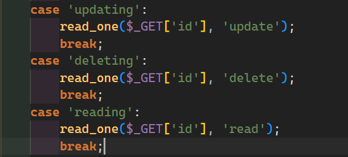
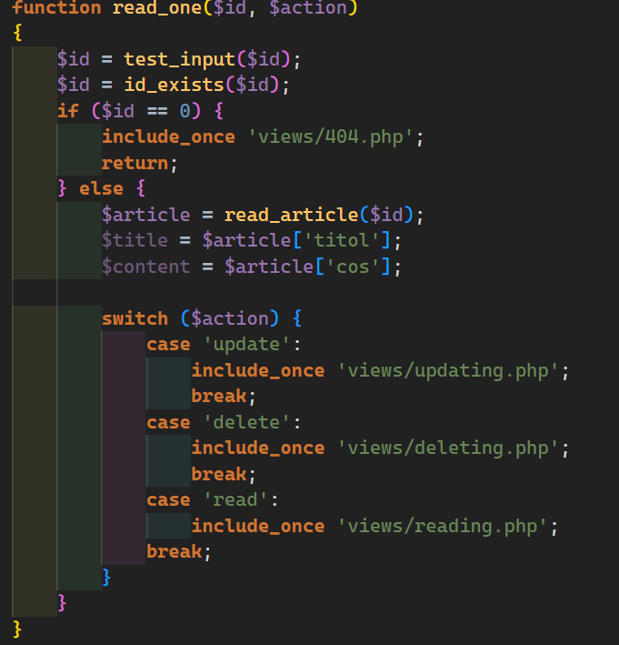
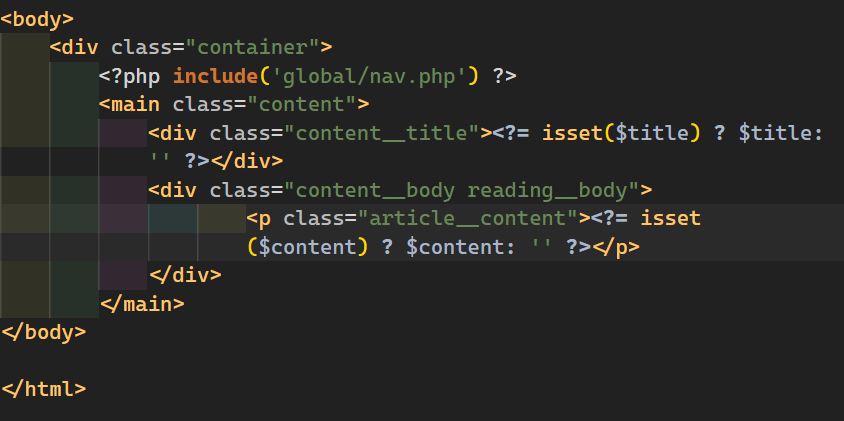
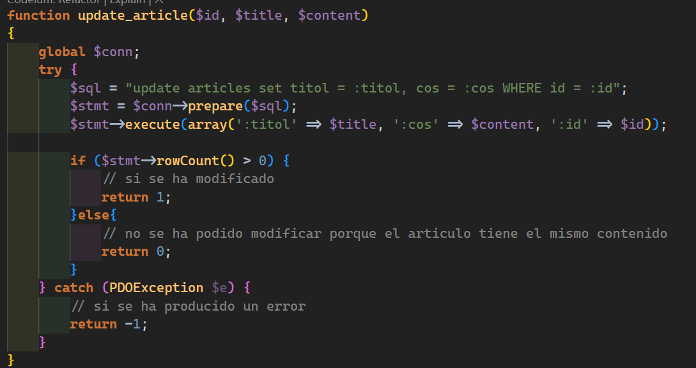
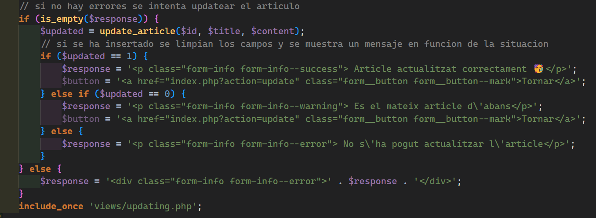
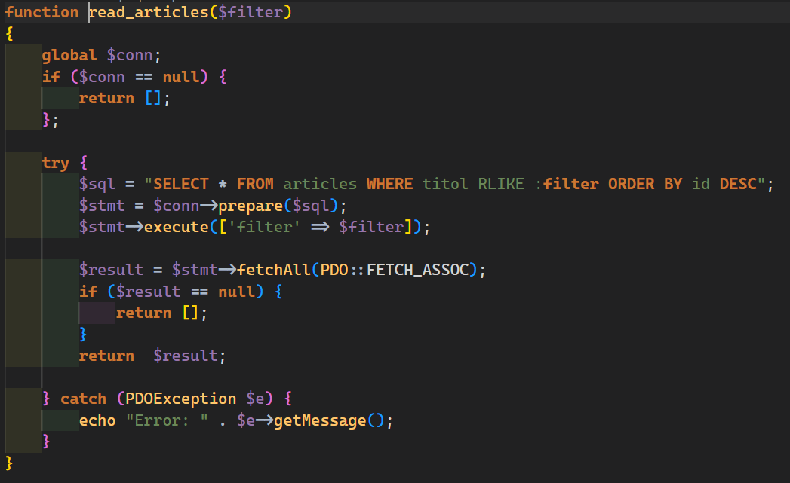
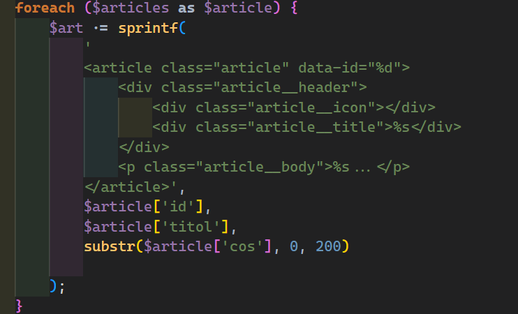
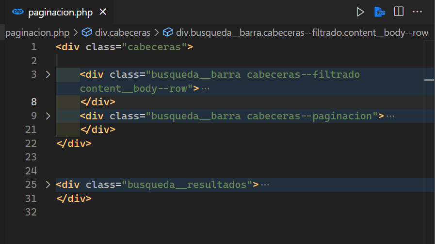

# Proyecto Articulos
<!-- TOC -->
* [Proyecto Articulos](#proyecto-articulos)
  * [🔁Recordatorio del pt02](#recordatorio-del-pt02)
    * [Gestion de articulos](#gestion-de-articulos)
        * [🥇Vistas principales](#vistas-principales)
        * [🥈Vistas secundarias](#vistas-secundarias)
        * [💥Vista de error](#vista-de-error)
        * [♻️Componentes reusables de estilo](#componentes-reusables-de-estilo)
    * [🎢Workflow](#workflow)
    * [🍱MISC](#misc)
  * [➡️Cambios con respecto a la version anterior en pt03](#cambios-con-respecto-a-la-version-anterior-en-pt03)
    * [🧐👆Justificacion de los cambios](#justificacion-de-los-cambios)
  * [➡️Cambios con respecto a la version anterior en la nueva pt04](#cambios-con-respecto-a-la-version-anterior-en-la-nueva-pt04)
    * [🧐👆Justificacion de los cambios](#justificacion-de-los-cambios-1)
<!-- TOC -->
## 🔁Recordatorio del pt02

### Gestion de articulos

Mi proyecto tiene 4 pilares fundamentales:

1- ```index.php``` este hace de "enrutador" y gestiona las peticiones ```get```,llamando a las respectivas vistas, y ```post``` llamando las funciones del controlador correspondientes.

2- ```controlador.php``` este se encarga de obtener ```los datos del modelo``` segun sea necesario e incluir las vistas para mostrarlos. Además valida los inputs con funciones de validacion y emite el html pertinente para que sea usado en la vista.

3- ```db.php``` este se encarga de conectar con la base de datos (usando ```connect.php```), de ejecutar las sentencias y devolver los datos en arrays asociativas.

4- las diversas vistas:

##### 🥇Vistas principales

* ```read.php``` (vista de seleccion para leer, página principal)
* ```update.php``` (vista de seleccion para update)
* ```insert.php``` (formulario de inserción)
* ```delete.php``` (vista de seleccion para delete)

Son las vistas con las que el usuario interactua al principio de todo. son tratadas por el index en el GET.


##### 🥈Vistas secundarias

* ```reading.php``` (vista de lectura de un elemento)
* ```updating.php``` (formulario de actualización de un elemento)
* ```deleting.php``` (formulario de borrado de un elemento)

##### 💥Vista de error

* ```404.php``` (vista de error 404, imagen sacada de httpcats)


##### ♻️Componentes reusables de estilo

* ```nav.php``` (componente de navegación)
* ```estilos.php``` (link de importacion de css)

### 🎢Workflow

El usuario tiene acceso a las paginas principales y puede:

* Ver todos los articulos, clickar en uno y leerlo
* Insertar un nuevo articulo y luego volver a la vista principal
* Actualizar un articulo y volver al menu para seleccionar otro y actualizarlo
* Borrar un articulo, volver al menu para seleccionar otro y borrarlo

Cuando se hace una peticion a las vistas principales el index controla la peticion y redirige a la vista correspondiente


Dentro de cada pagina hay un script que se encarga de detectar el click y hacer la peticion ```GET``` correspondiente con el id del elemento clickado.

Todos los scripts tienen una estructura similar pero cambiando la action


Esta peticion, segun sea el caso, es gestionada por el ```index.php``` y como las páginas que serán pintadas tienen datos en funcion del ``$id`` llama al controlador pasandole los datos de la peticion.



En la funcion ```read_one``` se obtienen los datos y se pintan las páginas en funcion de la `$action` pasada



En todas se obtienen los datos y se pasan mediante las variables $title y $content para que sean pintadas en el contenedor correspondiente, siempre comprobando que esten seteadas

Ejm (reading.php):



En el caso de updating y deleting hay un formulario en la pagina que contiene un submit


El submit hace la peticion ```POST``` que envía el id del elemento clickado, ademas del título y el contenido según sea el caso, por parametro de url. Esta peticion la recibe el `index.php` que llama al controlador pasandole los datos recibidos.


El controlador verifica que el id exista, que los campos no esten vacios, que se no haya inyeccion de codigo.

*** test_input -> sanitiza el input (ver funcion en controlador)***


Una vez hechas las comprobaciones, entonces se mandan los datos a modelo para ejecutar la sentencia.



Las funciones del modelo retornan flags al controlador para comprobar si se ha podido hacer la operación y asi enviar los mensajes correspondientes a la vista.



### 🍱MISC

-> La funcion de filtrado funciona haciendo peticiones get que gestiona el index con la `$action` de filter.


La funcion read del controlador admite un parametro opcional que es el filter y a su vez la funcion del modelo `read_articles($filter)` también (filter es un string o ''). Por defecto no hay filter y por tanto se muestra todo pues la sentencia `RLIKE ''` machea todos los articulos



El array asociativo que se retorna se devuelve a controlador, este le pone los elementos HTML y CSS correspondientes y lo envia a la vista.



-> `El unico javascript que hay en este codigo es para hacer redirecciones usando event listeners`

-> Los efectos visuales son Css puro animando el on hover de los pseudo elementos `::before` y `::After`

-> Los estilos css estan en formato BEM, es decir, no hay estilos por id. Esto hace facil el reutilizar estilos y poder ponerselos desde el php dinamico.

-> hay dos componentes globales html, nav y el link de los estilos. Esto se hizo asi para evitar reescribir todas las veces el nav y los estilos.

## ➡️Cambios con respecto a la version anterior en pt03

Se han añadido nuevas funciones que se encargan del compaginado 

📄Controlador.php:

* `function paginate($page = PAGE, $limit = LIMIT, $filter = FILTER)`

* `function crear_links($limit = LIMIT, $page = PAGE, $filter = FILTER)`

* `function max_articles()`

📄db.php:

* `function obtener_total($filter = FILTER)`

* `function obtener_articulos($page = PAGE, $limit = LIMIT, $filter = FILTER)`

Se han modificado las vistas para que trabajen con las nuevas funciones y se ha agregado un componente nuevo dentro de 📁Global

📚 vistas

* `read.php`
* `delete.php`
* `update.php`




Se ha repensado la manera de añadir el filter a la url teniendo en cuenta los nuevos parametros de `page` y `limit` y manteniendo el action de `update` y `delete` intactos.

Se han eliminado los archivos de `filterM.js` y `filterD.js` y se han sustituido en las vistas por `filter.js` que funciona para todos los casos.

Se ha agregado además `paginacion.js `, que sirve para actualizar el parametro `limit` cada vez que el campo con el numero de articulos por paginas cambia.

Naturalmente, se han agregado estilos nuevos para la barra de paginacion.

### 🧐👆Justificacion de los cambios

La intencion al hacer un nuevo componente global es cambiar la menor cantidad de codigo posible y mantener el funcionamiento anterior con la mejora de la paginacion.

La logica es la misma, principalmente solo se ha sustituido el uso de la funcion read() por la funcion paginate() y se ha agregado la barra de paginacion usando crear_links().

## ➡️Cambios con respecto a la version anterior en la nueva pt04
### 🧐👆Justificacion de los cambios